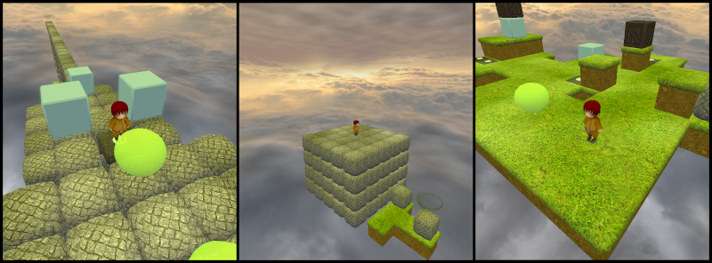

Puzzle Moppet
===================

A challenging 3D puzzle game where you must guide the Moppet through the vast 
and eternal void of space by solving the various and beautiful puzzles thrown 
at you.

This project is an effort to make the original Puzzle Moppet open source, 
replace art assets and continue the game development. Videos, details and 
binaries can still be found at original developer's website: 
http://garnetgames.com/puzzlemoppet.

Releases
========

Windows / Linux
---------------

Check out the [Releases page](https://github.com/karjonas/Puzzle-Moppet/releases) on GitHub to download binaries for Windows 10 and an AppImage for Linux systems.

Arch Linux
----------

For Arch Linux users Puzzle Moppet is available through the AUR with the [puzzlemoppet-git](https://aur.archlinux.org/packages/puzzlemoppet-git/) package.

Building
========

The following section details how to build Puzzle Moppet on a Linux system. Building for Windows is quite similar, you first install the dependencies (git, vcpkg) and then you can open the CMakeLists.txt directly in Visual Studio.

Requirements
------------

- [CMake](https://cmake.org/)
- [git](https://git-scm.com/)
- [vcpkg](https://github.com/microsoft/vcpkg/)
    - [Irrlicht](http://irrlicht.sourceforge.net/)
    - [ODE](http://www.ode.org/)
    - [OpenAL Soft](https://openal-soft.org/)

Distribution specific instructions
----------------------------------

Ubuntu:

    sudo apt-get install build-essential cmake libxxf86vm-dev libopenal-dev git curl unzip tar libgl1-mesa-dev

Arch Linux:

    sudo pacman -S openal cmake make gcc git

Dependencies
------------

Open a terminal, then install vcpkg and the dependencies:

    git clone https://github.com/microsoft/vcpkg.git
    cd vcpkg
    ./bootstrap-vcpkg.sh
    ./vcpkg install irrlicht ode openal-soft

If running Windows 64-bit make sure to provide the triplet like this:

    ./vcpkg install irrlicht ode openal-soft --triplet=x64-windows

Building the Game
-----------------

Open a terminal/console window, then clone the project, make a build directory, run CMake and Make (replace <VCPKG_DIR> with the vcpkg path):

    git clone https://github.com/karjonas/Puzzle-Moppet.git
    cd Puzzle-Moppet
    mkdir build
    cd build
    cmake .. -DCMAKE_TOOLCHAIN_FILE=<VCPKG_DIR>/scripts/buildsystems/vcpkg.cmake
    make

Running the game
----------------

    ./projects/Puzzle/bin/puzzlemoppet

Running the editor
------------------

Run the executable with command line parameter "-e" followed by a level name to invoke the editor:

    ./projects/Puzzle/bin/puzzlemoppet -e level_name.lev

where level_name.lev is either one of the levels in the "projects\Puzzle\levels\levels" directory or a completely new name to create a new level).

Controls:

- Mouse wheel to toggle between block type selection and editing
- Left mouse to add a block.
- Right mouse to remove a block.
- Arrow keys or WSAD to fly around the level.
- "S" to save, but the level is auto saved on exit anyway.
- Esc or Alt+F4 to exit.

To run a specific level omit the -e flag:

    ./projects/Puzzle/bin/puzzlemoppet level_name.lev

License Information
-------------------

Please see specific license files in /puzzlemoppet/licenses.

Except otherwise noted, source files are released under WTFPL, version 2.0. 
Game assets are released under a free license, usually CCBYSA3 or GPLv3+. Asset 
files created by Daniel Frith (original author) are released under WTFPL.
